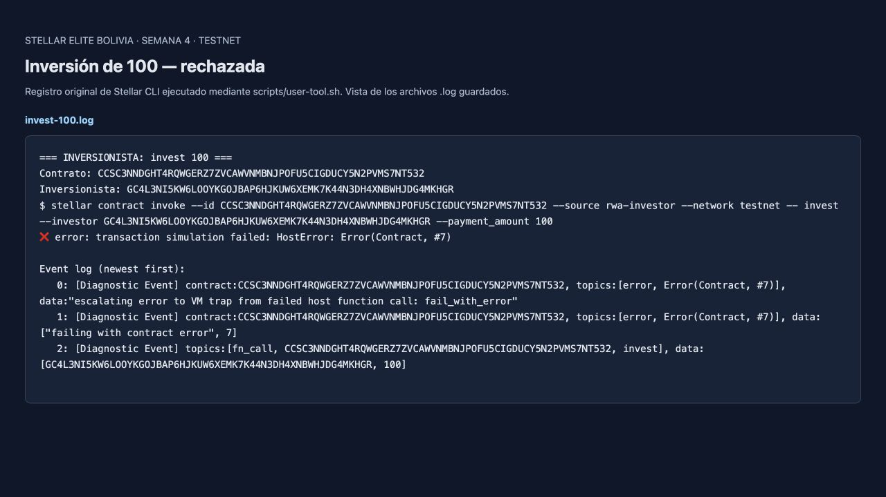
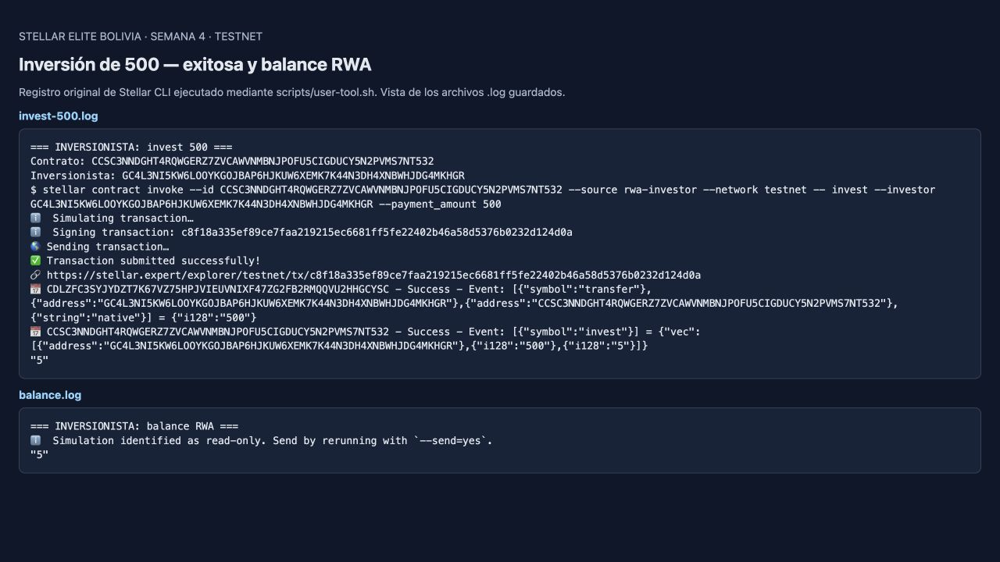
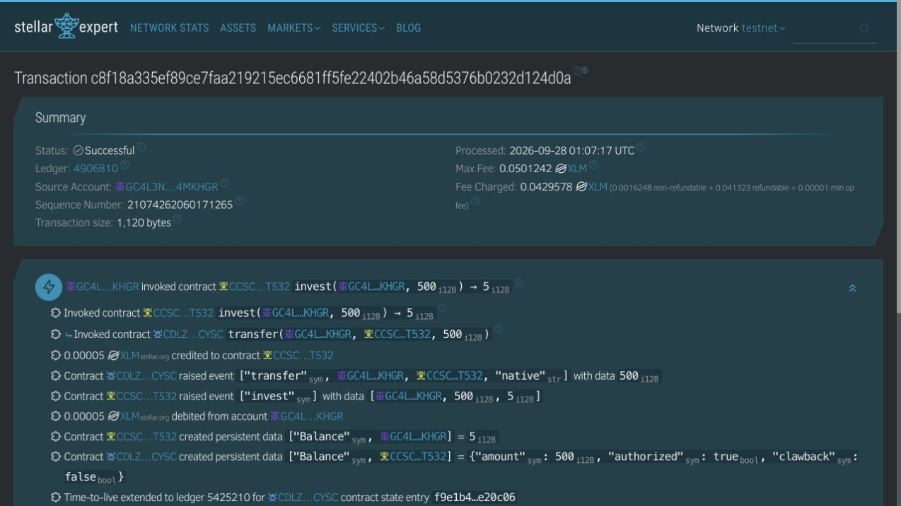

# Tarea final · Stellar Elite Bolivia · Semana 4

**Alumno:** Mateo Munguia  
**Red:** Stellar Testnet  
**Fecha de demostración:** 27 de septiembre de 2026, 21:07 (Bolivia)

## Links para entregar

- **Repositorio (fork):** https://github.com/mmunguia0907/rwa-launchpad-bootcamp
- **Carpeta del trabajo:** https://github.com/mmunguia0907/rwa-launchpad-bootcamp/tree/main/dia-3
- **Contract ID:** `CCSC3NNDGHT4RQWGERZ7ZVCAWVNMBNJPOFU5CIGDUCY5N2PVMS7NT532`
- **Contrato en Stellar Expert:** https://stellar.expert/explorer/testnet/contract/CCSC3NNDGHT4RQWGERZ7ZVCAWVNMBNJPOFU5CIGDUCY5N2PVMS7NT532
- **Inversión exitosa de 500:** https://stellar.expert/explorer/testnet/tx/c8f18a335ef89ce7faa219215ec6681ff5fe22402b46a58d5376b0232d124d0a

## Qué implementé

Agregué `AmountTooLow = 7` y pasé `payment_amount` a `check_variation_gate`. El gate exige `payment_amount >= 500` en cada inversión. El test `test_minimum_investment_100_fails_500_succeeds` comprueba el rechazo exacto de 100, la ausencia de movimientos de saldo al fallar y el éxito de 500 con balance final de 5 RWA.

Usé los scripts `admin-tool.sh` y `user-tool.sh` del repositorio, adaptados a subcomandos. El admin inicializó el contrato y aprobó al inversionista; el usuario intentó 100, invirtió 500 y consultó su balance. No se ejecutó un mint administrativo para producir ese saldo.

## Evidencia

Las primeras dos imágenes son **capturas de un visor local de los registros originales de Stellar CLI**, conservados al lado en archivos `.log`. La tercera es una captura directa de Stellar Expert. No son pantallas simuladas ni resultados inventados.

### 1. Inversión de 100 rechazada

`HostError: Error(Contract, #7)` corresponde a `AmountTooLow`. El CLI la rechazó en la simulación; no se envió una transacción fallida a la red.

[Registro original](evidence/invest-100.log)

### 2. Inversión de 500 exitosa y balance

La inversión transfirió 500 unidades mínimas del token de pago al contrato y emitió 5 RWA. La consulta `balance` devuelve `5`.

[Registro de inversión](evidence/invest-500.log) · [Consulta de balance](evidence/balance.log)

### 3. Confirmación independiente en el explorer

Stellar Expert muestra **Successful**, ledger **4906810**, `invest(..., 500) → 5`, evento `invest` y estado persistente `Balance(inversionista) = 5`.

## Administración

- [Inicialización confirmada](https://stellar.expert/explorer/testnet/tx/30110f4e11acbb759c424bac9cdfe2ac1403e12e672ab2d27d77e72ff5e87186)
- [Whitelist confirmada](https://stellar.expert/explorer/testnet/tx/383b060683547832cd32c1975c2cc4eea287b914b9732dd721071344e5910bb9)
- [Registro del script de admin](evidence/admin-setup.log)

Inversionista: `GC4L3NI5KW6LOOYKGOJBAP6HJKUW6XEMK7K44N3DH4XNBWHJDG4MKHGR`.

## Unidades del token

Se usó **XLM de Testnet**, autorizado como alternativa al token del instructor. Los montos siguen la escala entera del código del bootcamp: `100` y `500` son unidades mínimas. **500 stroops = 0.00005 XLM de prueba**; `price_per_unit = 100`, por eso se emiten 5 RWA. No se utilizaron fondos reales.

## Validación y artefacto

- **6 tests aprobados, 0 fallidos:** [salida de pruebas](evidence/tests.log).
- **Compilación correcta:** [salida de compilación](evidence/build.log).
- Stellar CLI 28.0.0, Rust 1.98.1, Soroban SDK 26.1.1 (rama 26 del bootcamp).
- [WASM desplegado](evidence/rwa_launchpad_dia_3.wasm), 7863 bytes.
- SHA-256: `8f7f3cf251c71672ada47e44a10f7d60b25738e1e7ac9f0663d980ce2cf11570`.

Los avisos de deprecación de `Events::publish` provienen del estilo de eventos del código base; no impidieron las pruebas, la compilación ni la ejecución.

[Instrucciones para reproducir](README.md) · [Guion opcional de menos de 2 minutos](GUION-2-MINUTOS.md)
